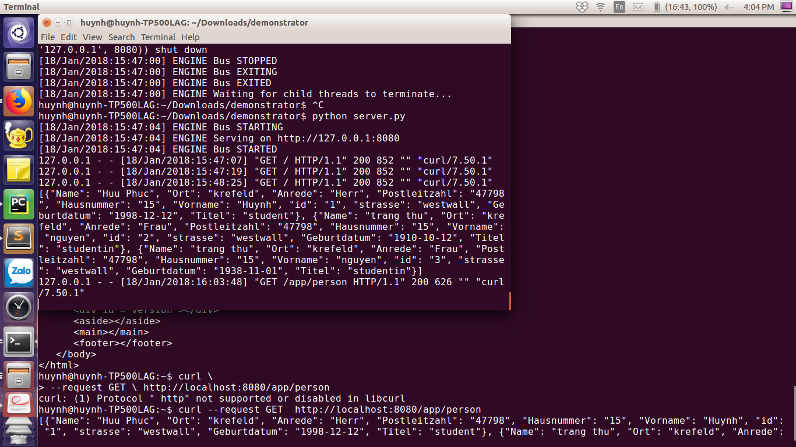
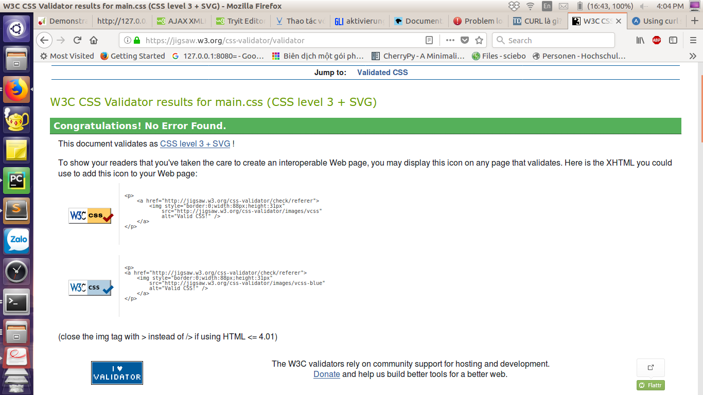

**WEB Praktikum 4 - WS 17/18**
 
**Gruppe: E**
 
**Team: Huu Phuc Huynh**
 
**Datum: 18.1.2018**

___

#Dokumentation

###Allgemeine Beschreibung der Lösung:

Pensionärsliste auf Seiten des Frontends mit  Klassen in Python umgesetzt

An das Frontend werden  J.S. Dateien, eine CSS Datei und aus Templates generierter HTML-Codes geliefert.

###Aufbau der Webanwendung:
 
Besteht aus: 
 
- 6 Python Dateien zur die die Anwendung bilden

- 1 Python Datei zur Serverumsetzung

- 7 JavaScript Datei um Events in der Liste zu aktivieren ( hier für die Bestätigung des löschens genutzt)

- 1 CSS Datei um Liste und Form gestalten

- 2 JSON Datei zur Verwaltung der Datensätze

- 1 Templatedateien zur Erstellung der Listen und Formen als HTML-Code

- 1 HTML-datei zur allgemein bilden

###Beschreibung der Serverkomponenten:
 
####server.py: 
 
Zweck:

-Startet den Server

Aufbau:

-Besteht aus einer main funktion und ihrem Aufruf.

Zusammenwirken mit anderen Komponenten:

-Initialisiert die Klasse Application,template
 
 API:
 
-main()
 
####application.py:
 
Zweck:

-F&uuml;hrt die Komponenten des Servers zusammen

-Stellt Schnittstelle zum Frontend

####view.py:
 
Zweck:

-Zusammenstellen von Html Views

####view_cl.py:

-Zusammenstellen von Html Views aus Templates 

####databse.py:

-Verwaltung von Datenbank

####varabeitung.py:

-geburtdatum von Pensionäre zu verwalten

###Datenablage:
-2 JSON dateien fuer Datenbank
-1 JSON datei fuer die Pensionäre
-1 JSON datei fuer die Vorlage

####Ergebnis:

 
___

